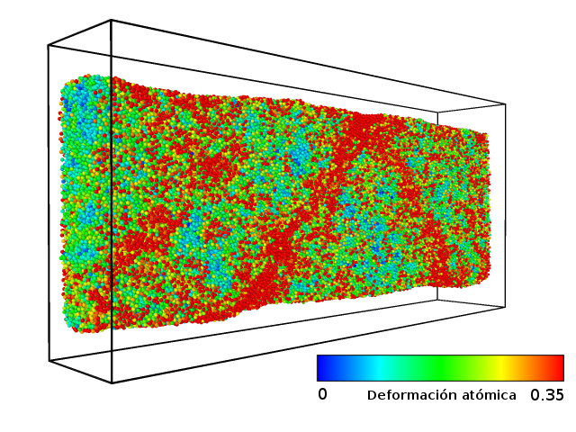
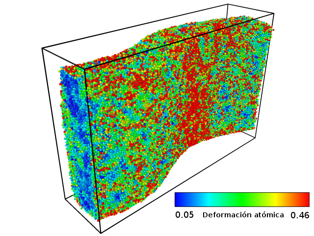

# Estudio Termo-Mecánico de un Metal Amorfo: Simulaciones Atomísticas

## Autores
Franco Ardiani

Andrés A. Manelli

## Abstract

Los metales amorfos, es decir, sin estructura cristalina (también llamados vidrios metálicos);
son cada vez más utilizados en la actualidad, mostrando un gran potencial como materiales avanzados para la ingeniería, debido a sus notables propiedades, entre las cuales destacan una alta dureza, moldeabilidad, resiliencia, resistencia mecánica y resistencia al desgaste. Todas estas propiedades permiten la obtención de partes resistentes con formas complejas que aumentan la posibilidad de usos industriales de estos materiales. Sin embargo, estas aplicaciones se ven restringidas por la heterogeneidad del régimen plástico.

Para lograr una mejor comprensión del régimen plástico se puede proceder con dos enfoques principales: el comportamiento a escala nanométrica o a escala del continuo. En el primer enfoque, adoptado en este trabajo, las simulaciones con dinámica molecular (MD por sus siglas en inglés) son frecuentemente utilizadas. Esta última permite resolver problemas en los cuales interactúan muchos cuerpos (átomos) mediante la aplicación de un potencial interatómico; como así también estudiar propiedades a escala nanométrica, tales como la deformación, la tensión, la temperatura, entre otras.

También se pueden utilizar las simulaciones de MD para identificar procesos plásticos en materiales tales como los vidrios metálicos volumétricos o _Bulk Metalic Glasses_ (BMG). En este caso en particular, la plasticidad comienza con la formación de zonas de transformación de tensión de corte o _Shear Transformation Zones_ (STZ), las cuales se nuclean, formando bandas de corte a medida que la deformación aumenta. Las bandas de corte o _Shear Bands_ (SB) pueden conducir a una fractura frágil en el material debido a la deformación heterogénea. De allí la importancia de prevenir o retrasar su propagación.

Para controlar y por consiguiente mejorar la dinámica de la plasticidad, la composición de los vidrios metálicos se modifica de diferentes maneras. Entre ellas, encontramos la inclusión de nanopartículas cristalinas y la inclusión de nanoporos. Ambas logran obstaculizar la propagación y crecimiento de SBs, obteniéndose una deformación más reducida y homogénea en régimen plástico.

En este trabajo se presentan experimentos numéricos respecto al comportamiento de vidrios metálicos. En una primera instancia, se analiza una matriz amorfa bajo diferentes condiciones de carga y temperatura. En una segunda instancia, se investigan los dos casos de composición modificada nombrados anteriormente: agregado de inclusiones cristalinas de cobre con estructura de cubo centrada en las caras (FCC) y de cobre-circonio en fase B2; y el sinterizado de un vidrio metálico a partir de nanopartículas de BMG, lo cual resulta en muestras con cierta porosidad.
